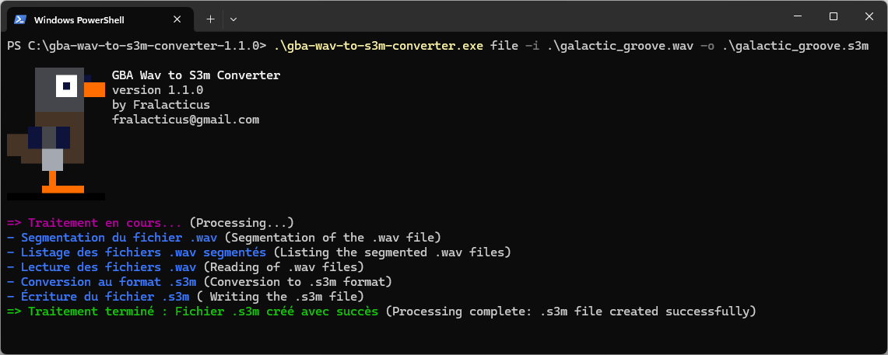

# GBA Wav to S3m Converter



## Description

Ce logiciel est conçu pour convertir des fichiers audio .wav de longue durée en un seul fichier .s3m, facilitant ainsi l'ajout de musique sur Game Boy Advance (GBA).   
Il s'adresse particulièrement aux développeurs utilisant la bibliothèque [Butano](https://github.com/GValiente/butano), en leur offrant la possibilité d'intégrer des musiques étendues dans leurs jeux.

**Important :** Les données brutes sonores sont préservés (section 'data' des fichiers .wav).

## Compatibilité
Ce logiciel est a été testé et validé sous Windows 11.
**Attention** : dans la release il y a des executables pour Linux et macOS, mais non vérifiés actuellement.

## Options d'utilisation

### Prérequis des fichiers .wav
Assurez-vous que vos fichiers .wav ont les paramètres suivant :
- **Canaux** : Mono
- **Fréquence** : 22050 Hz
- **Encodage** : Unsigned 8-bit PCM   
  Vous pouvez ajuster ces paramètres en utilisant [Audacity](https://www.audacityteam.org) :
  


### Option 1: Utilisation avec l'exécutable de la release
Pour une utilisation rapide et sans installation.  
Téléchargez d'abord le dossier contenant l'executable via la page [Releases](https://github.com/fralacticus/gba-wav-to-s3m-converter/releases) sur GitHub.  
- **Convertir un fichier .wav :** 
Exécutez l'application en spécifiant le chemin du fichier .wav à convertir et le chemin de sortie pour le fichier S3M résultant :
```powershell
./gba-wav-to-s3m-converter.exe file -i "chemin/vers/le/fichier.wav" -o "chemin/vers/le/fichier.s3m"
```

- **Agréger des fichiers .wav à partir d'un dossier :**
Exécutez l'application en spécifiant le chemin du dossier contenant les fichiers WAV et le chemin de sortie pour le fichier S3M résultant :
```powershell
./gba-wav-to-s3m-converter.exe folder -i "chemin/vers/le/dossier" -o "chemin/vers/le/fichier.s3m"
```

### Option 2: Utilisation à partir du code source
Assurez-vous d'avoir installé Dart sur votre système.   
Une méthode rapide et sans installation est de [télécharger directement l'archive du SDK](https://dart.dev/get-dart/archive) la plus récente pour Windows.  
Il suffit ensuite d'ouvrir une console à la racine du code source et saisir le chemin de l'exécutable de Dart, comme ci-dessous.

## Intialiser le projet
- Lancez d'abord la commande d'initialisation (à ne faire qu'une fois):  
```powershell
"chemin/vers/le/sdk/bin/dart.exe" pub get
```

- **Convertir un fichier .wav :**
  Exécutez l'application en spécifiant le chemin du fichier .wav à convertir et le chemin de sortie pour le fichier S3M résultant :
```powershell
"chemin/vers/le/sdk/bin/dart.exe" ./bin/core/main.dart file -i "chemin/vers/le/fichier.wav" -o "chemin/vers/le/fichier.s3m"
```

- **Agréger des fichiers .wav à partir d'un dossier :**
  Exécutez l'application en spécifiant le chemin du dossier contenant les fichiers .wav et le chemin de sortie pour le fichier S3M résultant :
```powershell
"chemin/vers/le/sdk/bin/dart.exe" ./bin/core/main.dart folder -i "chemin/vers/le/dossier" -o "chemin/vers/le/fichier.s3m"
```

## Licences
- Ce projet est sous licence zlib, voir le fichier [LICENSE](https://github.com/fralacticus/gba-wav-to-s3m-converter/blob/master/LICENSE) pour les détails.  
- Les autres ressources sont sous d'autres licences : 
  - La musique d'exemple Galactic Groove : [galactic_groove_credits.txt](https://github.com/fralacticus/gba-wav-to-s3m-converter/blob/master/examples/galactic_groove_credits.txt)

## Contact
Fralacticus - fralacticus@gmail.com  
Si vous avez repéré un bug, avez besoin d'une fonctionnalité ou avez une idée géniale, le mieux que vous puissiez faire est de vous rendre sur la [page des problèmes (Issues)](https://github.com/fralacticus/gba-wav-to-s3m-converter/issues).